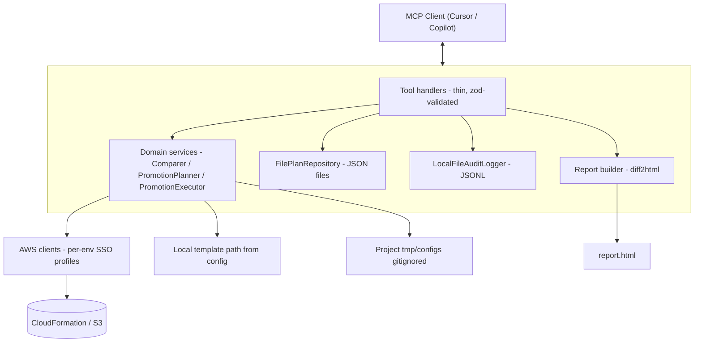

# PromoteOps MCP Server — Implementation Plan

## Project location
Greenfield at `/Users/hitesh/projects/promoteops` (directory exists, currently empty).

## Goal
An MCP server, installable via `npx promoteops`, that:
1. Reports which CloudFormation stacks / S3 config files / S3 binaries are out of sync between **test vs dev** and **prod vs test**, rendered as a browsable HTML report (GitHub-style diffs) plus a short chat-friendly summary.
2. Lets the user promote an outdated item through a strict **plan → execute** flow with no AWS mutation during planning, and native MCP elicitation (or token fallback) before any write.
3. Never lets an agent chain "diff" and "apply" into a single call.

## Core design decisions (finalized in discussion)

- **Language:** TypeScript, MCP SDK (`@modelcontextprotocol/sdk`) + AWS SDK v3.
- **No React, no .NET** anywhere in this project.
- **Mapper file** (`mapper.json`) is brand-new and populated incrementally as we go. Shape: `{ mappings: { [templateName]: [{ dev, test, prod }, ...] } }`, with sentinel values `NOT_DEPLOYED` (missing, not yet deployed) and `EXCLUDED` (intentionally skip that env for that instance). Templates absent from the mapper are out of scope — no auto-discovery in v1.
- **Instance identification:** each array entry (instance) is identified by its **dev stack name** (falling back to test, then prod, when dev itself is `NOT_DEPLOYED`) — no numeric indices in tool calls.
- **Env comparison pairs (reports and drift status):** live templates compared **test vs dev** and **prod vs test**. Same pairs for configs/binaries where applicable.
- **Stack comparison:** `GetTemplate` + normalize (parse YAML/JSON to canonical form) + SHA-256 hash for equality, plus `DescribeStacks` timestamp (`LastUpdatedTime`) to show which side is newer. Parameters are excluded from stack status/diffing (each env intentionally has different values).
- **Config comparison:** S3 `HeadObject`/`GetObject` — timestamp-only for report status (no hashing); all configs are JSON, so on-demand diff is a structural key-level diff.
- **Binary comparison:** S3 timestamp-only comparison test vs prod.
- **Binary promotion:** copy-only (`CopyObject` test→prod). No pipeline trigger call — the S3-drop-triggered deployment already exists on the AWS side.
- **Plan/execute split (hard rule):** every mutating action is two separate tool calls. Plan tools are 100% read-only (no `CreateChangeSet` during planning — moved to execute time, right before `ExecuteChangeSet`, so no idle change sets are left in AWS if the user changes their mind).
- **Parameters:** plan step returns the full list of **current live parameter values** (from `DescribeStacks`) for user re-verification (no silent carry-forward), plus any **new parameters** not present on the current stack (template `Default:` shown only as a hint, never auto-applied). User supplies overrides/new values via a second `plan_*` call before finalizing; execute always sends explicit resolved values (no `UsePreviousValue` ambiguity).
- **Template source for promotion:** local git working tree file; **local template path comes from `config.yaml` / env config** (not the mapper), so promotion always reflects whatever branch the user currently has checked out.
- **Report vs promotion:** reports answer “are envs out of sync?” using live env pairs above; promotion pushes content from the configured local template path into the target env.
- **Config edit loop:** `get_config` writes into a **project-local** directory (e.g. `tmp/configs/`) that is **gitignored**; plan/execute use that edited file.
- **Local plan storage:** `PlanRepository` interface with a `FilePlanRepository` v1 implementation (JSON files under `~/.promoteops/plans/`), swappable later. Plans store a `planId`, target, resolved payload, and a `targetCurrentTemplateHash` snapshot for staleness detection at execute time (abort + ask to replan if target changed since planning).
- **Confirmation mechanism:** MCP elicitation (`ctx.elicit`) as the primary human-approval gate before any execute call (confirmed broadly supported, including Copilot).
- **AWS credentials:** SSO-based named profiles, one per env (`dev`, `test`, `prod`), configured in `config.yaml`; credential provider must handle SSO token expiry with a clear re-login message.
- **Audit logging:** `AuditLogger` interface; v1 = local JSONL file per install (`~/.promoteops/audit.log`); v2 (future, not in this pass) = S3-backed shared log. Each team runs their own instance with their own mapper/config/audit log — no shared state assumed.
- **Diffing/rendering:** `diff` (jsdiff) to compute unified diffs, `diff2html` to render GitHub-style HTML in the generated report.
- **Report output:** a generated `report.html` (grid + click-to-expand diff) written locally and opened in the browser, plus a compact chat-facing summary (counts) and shortlist (outdated/missing only — never all rows by default).

## Code organization principles (living guideline, not a locked contract)

- **Feature-first folders, not layer-first.** Top-level `src/` folders are named after what they do (`config/`, `mapper/`, `shared/`, `tools/`), not after an architectural layer like "domain" or "infra" — a folder name should be understandable without a vocabulary lesson.
- **No dedicated `types.ts` files.** A type lives in the file that owns/creates it, next to the function that produces it.
- **Types are not borrowed across responsibilities.** If file A produces a value and file B (a different responsibility — e.g. an orchestrator receiving a parser's output) needs to consume it, B declares its own local type describing only the fields it actually needs, instead of importing A's type. TypeScript's structural typing still catches real mismatches at the exact call site where they matter, so this doesn't sacrifice safety — it just avoids one module dictating another's contract. Local types are left unexported wherever possible, so the rule is enforced by the language (nothing to import) rather than by convention alone.
  - **Exception — schema ↔ parser pairing:** a zod schema module and its direct parser (`configFileSchema` + `parseConfigFile`, `mapperFileSchema` + `parseMapperFile`) are one job (validate, then hand back typed data), so the parser reuses the schema's inferred type as its own return type.
  - **Exception — fixed vocabulary:** `ENVIRONMENTS`/`EnvironmentName` (`shared/environment`) is shared everywhere. It's not a business-logic shape owned by one module, it's a fixed fact about the whole app (there are exactly three environments).
- **No jargon in file/concept names.** Prefer plain names a teammate can understand without a definition — e.g. `specialValues` (not "sentinels"), a plain uniqueness-check function folded into the module that uses it (not a dedicated "invariants" file).
- **Comments: class/file-level only by default.** Put a short comment at the top of a file (or on a class) explaining what that module/class is for. Do **not** add inline comments that narrate obvious code, restate architecture rules, or explain things the name already says. Inline comments are allowed only when a specific line's *why* is non-obvious (e.g. why a collision here is dangerous, or why we cache).
- **One subfolder per module (when it has a test).** Feature modules get their own folder holding the source file and its test (`config/loadConfig/loadConfig.ts` + `loadConfig.test.ts`). `shared/` stays flat — small helpers with no tests don't need a folder each. There is no mirrored top-level `tests/` tree.
- **Orchestrators wrap lower-level errors into one public error type** (`ConfigLoadError`, `MapperLoadError`) so callers only need to catch one thing per pipeline (read file → parse+validate → build normalized objects → orchestrator composes the result).
- **`tools/`** (M4+) — thin MCP tool handlers. They call into `config/`/`mapper/`/etc., shape the response for the MCP client, and contain no business logic of their own.

## Architecture



## Directory structure

```
promoteops/
  src/
    shared/                          # fixed vocabulary + generic helpers (flat — no per-file subfolders)
      environment.ts                 # ENVIRONMENTS, EnvironmentName
      fileIO.ts                      # readRequiredFile
      pathResolver.ts                 # resolveProjectRoot, resolveFromProjectRoot
      zodError.ts                     # formatZodError
      primitives.ts                   # nonEmptyString

    config/
      configFileSchema/               # zod: validates raw config.yaml
        configFileSchema.ts
        configFileSchema.test.ts
      parseConfigFile/                 # read text -> parse YAML -> validate
        parseConfigFile.ts
        parseConfigFile.test.ts
      resolveConfigPaths/              # paths -> absolute ResolvedConfigPaths
        resolveConfigPaths.ts
        resolveConfigPaths.test.ts
      loadConfig/                      # orchestrator: read -> parse -> validate -> resolvedPaths
        loadConfig.ts
        loadConfig.test.ts

    mapper/
      mapperFileSchema/               # zod: validates raw mapper.json
        mapperFileSchema.ts
        mapperFileSchema.test.ts
      parseMapperFile/                 # read text -> parse JSON -> validate
        parseMapperFile.ts
        parseMapperFile.test.ts
      specialValues/                   # NOT_DEPLOYED, EXCLUDED, isDeployableValue
        specialValues.ts
        specialValues.test.ts
      normalizeMapper/                 # build/normalize instances + uniqueness check
        normalizeMapper.ts
        normalizeMapper.test.ts
      loadMapper/                      # orchestrator: read -> parse -> validate -> normalize
        loadMapper.ts
        loadMapper.test.ts
      # M4+: comparer/promotion logic for stacks/configs/binaries land here or in their own feature folders

    aws/
      clients/                         # per-env CFN + S3 clients via SSO profiles
        clients.ts
        clients.test.ts
    # M4+: planStore/, audit/, report/

    tools/                          # MCP tool handlers — thin, calls config/mapper/etc. (M4+)
      reportStacks/
      reportConfigs/
      reportBinaries/
      diffStack/
      planStackPromotion/
      executeStackPromotion/
      getConfig/
      planConfigPromotion/
      executeConfigPromotion/
      planBinaryPromotion/
      executeBinaryPromotion/

    server.ts                        # registers tools, starts stdio transport
    index.ts                         # bin entrypoint

  # each module folder holds its own *.test.ts; excluded from tsc via tsconfig "exclude"
  tmp/
    configs/                         # config edit workspace; gitignored
  mapper.example.json                # starter shape, ships in repo
  config.example.yaml                # SSO profiles + local template path
  .gitignore                          # excludes real mapper.json/config.yaml and tmp/
  package.json                        # "bin": { "promoteops": "dist/index.js" }
  README.md
  docs/
    plan.md                          # this file
    mapper-schema.md
    tools-reference.md
    setup-aws-profiles.md
    safety-model.md
  LICENSE
```

## Tool contract summary

| Tool | Type | Behavior |
|---|---|---|
| `report_stacks()` | read-only | Compare all mapper stack entries (test vs dev, prod vs test); hash + timestamp; writes `report.html`, returns summary + outdated/missing shortlist |
| `report_configs()` | read-only | Same pattern for S3 configs, timestamp-only |
| `report_binaries()` | read-only | Same pattern for S3 binaries, timestamp-only |
| `diff_stack(devStackName, fromEnv, toEnv)` | read-only | Full GitHub-style template diff for one instance |
| `plan_stack_promotion(devStackName, targetEnv, paramOverrides?)` | read-only | Uses local template from config path; returns template diff + `currentParameters` + `newParameters`; on second call with `paramOverrides`, finalizes and saves a local `PlanRecord` |
| `execute_stack_promotion(planId)` | **mutating** | Elicit confirmation; staleness check against `targetCurrentTemplateHash`; `CreateChangeSet` + `ExecuteChangeSet` (created and consumed together); mark plan executed; audit log |
| `get_config(name, env)` | read-only | Downloads config to project `tmp/configs/` for review/edit |
| `plan_config_promotion(name, targetEnv)` | read-only | Diffs edited local temp file vs live target JSON object |
| `execute_config_promotion(planId)` | **mutating** | Elicit confirmation; `PutObject`; audit log |
| `plan_binary_promotion(name)` | read-only | Compares test/prod object timestamp |
| `execute_binary_promotion(planId)` | **mutating** | Elicit confirmation; `CopyObject` test→prod only; audit log |

## Milestones (testable gates)

Each milestone must pass its test gate before starting the next.

### M1 — Project scaffold
**Ship:** `package.json` with `bin`, TypeScript config, MCP/AWS/zod/diff deps, `.gitignore` (real mapper/config + `tmp/`), `mapper.example.json`, `config.example.yaml`, empty `tmp/configs/`.
**Test:** `npm install` + `tsc` succeed; process starts and exits cleanly on stdio.

### M2 — Config + mapper loading
**Ship:** Load `config.yaml` (SSO profiles, local template path) + brand-new `mapper.json` with zod; sentinel handling.
**Test:** Fixtures for valid load, reject bad files, resolve `NOT_DEPLOYED`/`EXCLUDED`, resolve local template path from config.

### M3 — AWS clients
**Ship:** Cached per-env CFN/S3 clients via SSO profiles from config (`src/aws/clients/`); clear expired-token / re-login messaging.
**Test:** Clients resolve for `dev`/`test`/`prod`; expired SSO produces a readable re-login message (`aws sso login --profile …`).

### M4 — Stack compare + report (read-only)
**Ship:** `StackComparer`, `report_stacks`, `diff_stack`, HTML report (`diff2html`), chat summary + outdated/missing shortlist.
**Comparisons:** live **test vs dev**, **prod vs test**.
**Test:** Run against a small real mapper slice; HTML opens; shortlist only drift/missing; no AWS writes.

### M5 — Config + binary compare + report (read-only)
**Ship:** Config/binary comparers + `report_configs` / `report_binaries` + HTML/shortlist.
**Test:** Same as M4 for configs/binaries; still zero mutations.

### M6 — Plan store + audit log
**Ship:** `FilePlanRepository` (`~/.promoteops/plans/`), `LocalFileAuditLogger` (JSONL); save/load/mark-executed; staleness fields on plan records.
**Test:** Round-trip a fake plan; mark executed; append audit line; no AWS required.

### M7 — Stack promotion (plan → execute)
**Ship:** `plan_stack_promotion` (local template from config path, param review, finalize `PlanRecord`); `execute_stack_promotion` (elicit, staleness, change-set-at-execute-time, audit).
**Test:** Plan produces no CFN writes; execute only after confirm; reject stale plan; audit entry written.

### M8 — Config promotion (plan → execute)
**Ship:** `get_config` → `tmp/configs/` → `plan_config_promotion` → `execute_config_promotion` (`PutObject` + elicit + audit).
**Test:** Download → edit temp → plan shows diff → execute uploads; confirmation gate works.

### M9 — Binary promotion (plan → execute)
**Ship:** `plan_binary_promotion` / `execute_binary_promotion` (`CopyObject` test→prod only).
**Test:** Plan is read-only compare; execute copies only after elicit; audit logged.

### M10 — Docs + end-to-end smoke
**Ship:** README + `docs/mapper-schema.md`, `tools-reference.md`, `setup-aws-profiles.md`, `safety-model.md`.
**Test:** Fresh setup → `report_*` → plan → execute (one stack + one config) with elicitation in the actual MCP client.

## Explicitly out of scope for this pass

- Auto-discovery / convention-based mapper generation
- Nested stack comparison
- Any React or .NET code
- S3-backed shared audit log (v2)
- Any tool that both plans and applies in a single call
