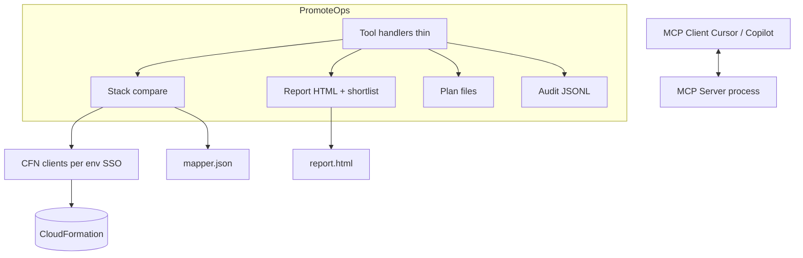

# PromoteOps MCP Server — Implementation Plan

Living document. Prefer evolving this over treating any earlier draft as locked.

## Origin and scope

PromoteOps is inspired by an internal tool (**StackMate**: .NET API + React UI) used at work to show CloudFormation template deployment status across **dev / test / prod**.

**What we take from StackMate (behavior, not a UI clone):**
- A **mapper file** listing which stack names belong to which template instance in each env
- Mapper special values **`NOT_DEPLOYED`** and **`EXCLUDED`**
- Per-environment status: deployed vs not, excluded, outdated vs current
- Comparison pairs: **test vs dev**, **prod vs test**
- **Unmapped stacks**: live AWS stacks whose names are not in the mapper (visibility only)
- Diff of live template bodies between environments

**What we deliberately leave out of this open-source product:**
- S3 config-file grids
- S3 binary copy / deploy flows
- Any MCP tools or milestones for configs/binaries

**What PromoteOps adds beyond StackMate:**
- Runs as an **MCP server** (Cursor, VS Code Copilot Agent, etc.) — not a hosted React/.NET app
- Strict **plan → execute** promotion for stacks (StackMate’s stack dashboard was read-only)
- Human confirmation via MCP elicitation before any AWS write
- Distribution via git / `npm pack` tarball (public npm only when the product is solid)

## Goal

An MCP server (bin `promoteops`) that:

1. Reports CloudFormation stack drift across **dev / test / prod** as a browsable **HTML report** plus a short chat summary and attention shortlist.
2. Lets the user promote an outdated stack through **plan → execute**, with no AWS mutation during planning.
3. Never combines “diff/plan” and “apply” in a single tool call.

## Project location

`/Users/hitesh/projects/promoteops`

## Core design decisions

### Product

- **Language:** TypeScript, MCP SDK, AWS SDK v3 (CloudFormation).
- **No React, no .NET** in this repo.
- **Stacks only** for v1 OSS.
- **Mapper** (`mapper.json`): `{ mappings: { [templateName]: [{ dev, test, prod }, ...] } }`. Templates absent from the mapper are out of scope for mapped rows; their live stacks may still appear under **unmapped**.
- **Instance id:** deployable stack name (prefer dev, else test, else prod) — no numeric indices in tool calls.
- **Env pairs:** compare **test ← dev** and **prod ← test** (higher env checked against lower).
- **Template source for promotion:** local git working tree; path from `config.yaml` (`templates.localPath`).
- **Plan / execute split:** plan tools are read-only; change sets created only at execute time (with elicitation).
- **Parameters:** plan returns current live parameters + new parameters from the local template; execute sends explicit values (no silent `UsePreviousValue`).
- **Plan storage:** `~/.promoteops/plans/` JSON; staleness via target template hash snapshot.
- **Audit:** local JSONL under `~/.promoteops/`.
- **Credentials:** SSO named profiles per env in `config.yaml`; expired session → clear `aws sso login --profile …` message.
- **Private distribution for work testing:** `npm pack` → Slack → `npm install -g ./promoteops-x.y.z.tgz` (easy to reinstall with a bumped version). Public npm later.

### Status model (per environment on a mapped instance)

Aligned with StackMate’s flags, with clearer naming for the report:

| Status | Meaning |
|---|---|
| `excluded` | Mapper value is `EXCLUDED` for that env |
| `not_deployed` | Mapper value is `NOT_DEPLOYED`, **or** mapper has a stack name but that stack is not found in AWS |
| `current` | Deployed and content matches the lower env (see drift rule) |
| `outdated` | Deployed and content differs from the lower env |

Dev has no “lower” env: it is never `outdated` from a pair comparison (it is the source side for test).

**Unmapped (separate from row status):** stack name exists in AWS for an env but is not referenced as a real stack name in the mapper for that env. Shown for visibility; not a promote target by default.

**Do not use** a report status called `missing` — that confused mapper `NOT_DEPLOYED` with “absent from mapper.”

### Drift rule (hash + timestamp)

Both are used; each has one job:

1. **Normalize** live template body → **SHA-256** → content equality.
2. **Timestamps** (`LastUpdatedTime` / create time) → which side is **newer** (display + `newerSide`).
3. For a higher env (test or prod), when both sides are deployable stacks:
   - hashes **equal** → `current` (even if clocks differ)
   - hashes **differ** → `outdated`, set `newerSide` from timestamps
4. Attention **shortlist** = mapped rows that are `outdated` or `not_deployed` (exclude `excluded` from “needs action” unless we later decide otherwise).

Normalization should reduce false drift from formatting/whitespace (JSON pretty-print / canonical form). Prefer hashing normalized content so pure formatting noise does not mark `outdated`.

### Code organization

- **Feature-first folders** (`config/`, `mapper/`, `stacks/`, `report/`, `aws/`, `tools/`, `shared/`).
- **One subfolder per module that has tests** (source + `*.test.ts` together). `shared/` stays flat.
- **No dedicated `types.ts` dumps.** A type lives with the module that owns it. Consumers declare their own local shapes when crossing responsibilities (schema↔parser pairing and `ENVIRONMENTS` are the agreed exceptions).
- **Comments:** short **file/class-level** purpose comments only. Inline comments only when a line’s *why* is non-obvious.
- **Plain names** (e.g. `clients`, `specialValues`, `buildReport`) — avoid jargon like “factory”, “sentinel”, “invariant” as folder names.
- **Report assets:** HTML markup and **CSS in separate files** under `report/` (not one giant inline HTML string forever).
- **Orchestrators** wrap lower errors into one public error type per pipeline (`ConfigLoadError`, `MapperLoadError`, `AwsClientError`, …).

## Architecture



## Directory structure (target)

```
promoteops/
  src/
    shared/
      environment.ts
      fileIO.ts
      pathResolver.ts
      zodError.ts
      primitives.ts

    config/
      configFileSchema/
      parseConfigFile/
      resolveConfigPaths/
      loadConfig/

    mapper/
      mapperFileSchema/
      parseMapperFile/
      specialValues/          # NOT_DEPLOYED, EXCLUDED
      normalizeMapper/
      loadMapper/

    aws/
      clients/                 # CloudFormation clients per env (SSO)

    stacks/
      stackComparison/         # result shapes, shortlist helpers
      compareStacks/           # M5: live fetch + normalize + hash + unmapped

    report/
      buildReport/             # write report + chat summary
      html/                    # markup builders
      css/                     # report.css (and related)

    fake/                      # temporary M4 fixture data + report:fixture CLI — delete after M5
      fixtureReport.ts
      writeFixtureReport.ts

    planStore/                 # M6
    audit/                     # M6

    tools/
      reportStacks/
      diffStack/
      planStackPromotion/      # M7
      executeStackPromotion/   # M7

    scripts/
      copyReportAssets.ts

    server.ts
    index.ts

  tmp/                         # report output etc.; gitignored
  mapper.example.json
  config.example.yaml
  docs/plan.md
  package.json
  README.md
```

## Tool contract (OSS)

| Tool | Type | Behavior |
|---|---|---|
| `report_stacks` | read-only | Compare mapped stacks; write HTML; return summary + shortlist + unmapped counts. Fixture mode until M5. |
| `diff_stack(instanceId, fromEnv, toEnv)` | read-only | Template diff for one instance/pair. |
| `plan_stack_promotion(instanceId, targetEnv, paramOverrides?)` | read-only | Local template vs target; params review; finalize `PlanRecord` on confirm path. |
| `execute_stack_promotion(planId)` | **mutating** | Elicit; staleness check; CreateChangeSet + ExecuteChangeSet; mark plan executed; audit. |

No config/binary tools in this product.

## Milestones

Each milestone must pass its test gate before the next.

### M1 — Project scaffold — completed
**Ship:** package bin, TypeScript, deps, gitignore, examples.
**Test:** install + `tsc`; process starts on stdio.

### M2 — Config + mapper loading — completed
**Ship:** `config.yaml` + `mapper.json` load/validate; `NOT_DEPLOYED` / `EXCLUDED`.
**Test:** fixtures for valid/invalid load, special values, path resolution.

### M3 — AWS clients — completed
**Ship:** Cached per-env CloudFormation clients via SSO; re-login errors.
**Test:** resolve for dev/test/prod; expired SSO message.
**Follow-up completed in M4:** removed unused S3 client wiring (OSS remains stacks-only).

### M4 — Report UX with fixtures — completed
**Ship:** Implement the locked **Report UX** section below against fixture data (no AWS):
- Per-env statuses: `current` / `outdated` / `not_deployed` / `excluded` (+ `unavailable` only for collection failure)
- Single unmapped-stacks table at the end (fixture data)
- Separate `report/html` + `report/css` sources; generated output is one self-contained `report.html`
- Chat summary + attention shortlist per contract (shortlist is a chat-only construct; the HTML surfaces attention via row ordering, not a duplicate section)
- MCP `report_stacks` / `diff_stack` in fixture mode
- `npm run report:fixture` → configured report path (default `tmp/report.html`)

**Test / acceptance (fixture must demonstrate all of these):**
- One mapped instance → exactly one main-matrix row (Dev/Test/Prod cells)
- Only approved mapped status labels appear; no `missing` / `in_sync` / `skipped`
- Matrix rows sorted attention-first (`not_deployed` → target-newer `outdated` → other `outdated` → rest); target-newer warning per Report UX
- Chat shortlist = actionable `outdated` + `not_deployed` only, sorted and capped
- Unmapped fixture stacks in one table with an environment column; empty matrix/unmapped states are clear
- Filtering/search + `Needs action only` toggle, empty state + “showing X of Y”; matrix still readable with JS disabled
- No partial-data banner in HTML; fixture does not simulate expired SSO as a mid-report status
- Both Dev→Test and Test→Prod outdated diffs present as **View diff** drawers titled with promotion direction; diffs are always embedded (no size deferral); beige light theme; opening a drawer does not scroll the page or leave a selected-row highlight
- No external network requests; copying only `report.html` preserves appearance and interaction
- Special characters in names cannot break markup; drawer works without JS and is keyboard-closable; print styles do not hide findings
- Packed/global install can locate source CSS and write the report outside the package directory
- No AWS calls

### M5 — Live stack compare — pending
**Ship:** Fetch stacks/templates per env; normalize + hash; timestamps; map via mapper; detect unmapped; feed the same report model.
**Test:** small real mapper slice on a machine with Leapp/SSO; HTML + shortlist correct; **zero AWS writes**.

### M6 — Plan store + audit — pending
**Ship:** File plan repo + JSONL audit; staleness fields.
**Test:** round-trip plan; mark executed; audit line; no AWS.

### M7 — Stack promotion — pending
**Ship:** `plan_stack_promotion` + `execute_stack_promotion` with elicitation and change-set-at-execute-time.
**Test:** plan read-only; execute only after confirm; stale plan rejected; audit written.

### M8 — Docs + E2E smoke — pending
**Ship:** README, mapper schema, tools reference, AWS profile setup, safety model.
**Test:** install (tarball or local) → configure → report → plan → execute one stack in Cursor or VS Code Copilot Agent.

## Report UX (redesigned — matrix-first)

Desktop-first operational report. The matrix **is** the report; everything else is trimmed to a glance. Ruthlessly cut redundant chrome: no summary cards, no per-env count buttons, no duplicated "needs attention" list. Answer **"what needs attention?"** by ordering and filtering the one matrix, not by repeating it in extra sections.

### Design principles (from the redesign)

- **One source of truth.** The mapped-stack matrix is the only place stack state lives. Any "at a glance" number is plain text, never a second interactive surface that competes with the matrix filters.
- **Surface attention in place.** Rows are sorted attention-first and a `Needs action only` toggle filters the matrix. No separate shortlist to scan-then-jump.
- **Density over padding.** Compact cells, tabular numerics, muted secondary text. Timestamps and short hashes are present but small (hash in the cell `title`).
- **Diffs get room, not cramped rows.** Diffs open in a focused slide-over drawer, not an inline disclosure squeezed under the row.
- **Calm palette.** Near-neutral surfaces; status shown as a small colored **dot + text label** rather than heavy saturated pills. Restrained blue accent for links only.

### Page hierarchy

1. Compact header: **PromoteOps** as the primary brand mark, “Stack report” as subtitle, and a single prominent **N need action** callout (mapped/unmapped counts stay in chat summary only)
2. **Mapped stack matrix** (primary; attention-sorted; filters + diff drawers) — no partial-data banner in HTML (auth/session failures fail the report before write)
3. **Ignored stacks** — single collapsible table at the **very end** (AWS stacks not tracked for promotion)
4. Collapsed "How to read this report" (methodology + report file path)

### Header

- Title: **PromoteOps stack report**, product mark, generated timestamp (timezone-explicit), source (`fixture`/`live`), region, flow **Dev → Test → Prod**
- One-line summary counts as plain text (mapped, need action, unmapped) — `need action` emphasized when > 0
- "Potentially sensitive infrastructure report" label

### Mapped stack matrix

- One stable row per mapper instance. Columns: **Template / Instance**, **Dev**, **Test**, **Prod**
- **Rows are sorted attention-first**: `not_deployed` → `outdated` (target newer) → other `outdated` → everything else; ties break by template then instance id. (No separate shortlist section.)
- Rows that need action carry a subtle `Needs action` tag and left accent in the identity cell
- Each environment cell (dense): status **dot + label**, stack name (monospace) or mapper special value, compact last-activity time, and **View diff** only when outdated. No comparison-context chrome (`Baseline source`, `Matches Dev`, etc.). Short hash lives in the cell `title` tooltip
- Dev is the source/baseline and is **never** labelled `outdated`
- Sticky table header + sticky identity column; horizontal scroll on narrow screens

### Status presentation

| Status | Meaning | Visual |
|---|---|---|
| `current` | Deployed; content matches lower env (or Dev baseline) | Green dot + "Current" |
| `outdated` | Deployed; content hash differs from lower env | Amber dot + "Outdated" |
| `not_deployed` | Mapper `NOT_DEPLOYED`, or mapped name not found in AWS | Red dot + "Not deployed" |
| `excluded` | Mapper `EXCLUDED` | Gray dot + "Excluded" |

`unavailable` remains in the data model for rare non-auth read failures, but is **not** shown in the status filter and is **not** used for expired SSO — expired/missing sessions fail the whole report before HTML is written.

Never rely on color alone (dot + text label always). Do not leak raw enum names into copy. Do **not** use statuses named `missing`, `in_sync`, or `skipped`.

### Filtering

- Progressive enhancement: search (template / instance / stack name), status filter (`current` / `outdated` / `not_deployed` / `excluded`), **Needs action only** toggle, **Clear**, and "Showing X of Y" (no matrix environment filter)
- Useful empty state ("No mapped stacks match these filters.")
- With JS disabled all rows remain readable; filters simply inactive

### Drift detail and diffs (drawer)

- Timestamps show **which side is newer**; they never define content equality
- If target is newer than source: **"Target is newer; review before promotion."**
- Each outdated cell has a professional **View diff** control (promotion direction is already implied by the column)
- Opens a **slide-over drawer**. With JS: class-based open, **body scroll lock**, no background jump, `Esc` / scrim / Close clears the hash (no selected-row highlight). Without JS: `:target` fallback still works
- Drawer title is promotion direction: **Dev → Test** / **Test → Prod**, with stack names as a subtitle (`payments-dev → payments-test`)
- Orientation line: “Left: Test (current). Right: Dev (proposed for promotion).”
- Hide Diff2Html file header chrome; wide = side-by-side, narrow = line-by-line
- Render diffs only for outdated pairs; **always embed** the full diff (no size deferral)

### Ignored stacks (last, single table)

- Placed at the **very end** — it can be long (20–30 per env) and must not push the matrix down
- **One collapsible table**. Columns: **Environment** (plain text, not status-style pills), **Stack**, **CloudFormation status**, **Last activity**
- Environment filter (All / Dev / Test / Prod) with “Showing X of Y”
- Sorted by environment then stack name; count shown in the section header
- Explain: these exist in AWS but are **not tracked for promotion** (outside the mapper)
- Empty state: "No ignored stacks found." / "No ignored stacks in this environment."

### Visual system

- Beige / warm paper light theme (forced light; no dark mode). System fonts, semantic status **dots**, restrained sage accent
- Compact readable density; sticky matrix header + identity column
- No external font/CDN dependency; no “potentially sensitive” banner copy in the header

### Responsive, accessibility, print

- Keep the relational table; horizontal scroll on narrow screens (never convert to unrelated cards); drawer becomes full-width
- Keyboard-operable controls, visible focus, semantic headings/table markup (`caption`, `scope`); diff drawer is a focusable `role="dialog"` closable by link or `Esc`
- Status never color-only; sufficient contrast; `prefers-reduced-motion` disables drawer animation
- Stable timezone-explicit dates
- Print CSS: diff drawers render inline (not hidden), table headers repeat, no nested scroll traps, ink-friendly surfaces, status text preserved

### Additional improvements delivered / possible next

- **Delivered:** attention-first ordering replaces the shortlist; `Needs action only` toggle; single unmapped table; drawer diffs; dark-mode-correct diffs; calmer dot-based palette; tooltip-hosted hashes/timestamps to cut clutter.
- **Possible next:** column sorting on the unmapped table; a per-row "copy stack name" affordance; remembering filter state in the URL hash; a compact "only changed since <date>" filter; keyboard shortcut to jump between attention rows.

### Chat summary contract (`report_stacks`)

Always return:

- Generated time + source (`fixture` / `live`)
- Mapped-instance count
- Attention counts by env/status
- Unmapped Dev / Test / Prod counts
- Partial-data warnings
- Target-newer warning count (if any)
- Capped shortlist + omitted count
- Absolute HTML path **and** encoded `file://` URI

Never dump all rows into chat. Empty attention → explicit “No mapped targets need attention.”

### Static assets, packaging, security

- Source: separate modules under `report/html`, `report/css` (+ optional minimal JS)
- Generated output: **one portable self-contained `report.html`** — inline authored CSS and pinned Diff2Html CSS at generation time
- No CDN, external fonts/images, runtime fetches, or neighboring asset requirements after generation
- Resolve packaged source assets relative to `import.meta.url`; write reports only to the configured output path (never inside the installed package)
- Reports may contain sensitive template bodies / identifiers: default path gitignored; write mode `0600`; atomic write-then-rename; escape all AWS/mapper-controlled text in HTML, attributes, IDs, and script-adjacent data; label report as potentially sensitive

## Explicitly out of scope (OSS v1)

- S3 config or binary comparison/promotion
- Auto-discovery of stacks into the mapper
- Nested stack deep comparison
- React or .NET UI in this repo
- Shared S3-backed audit log
- Any tool that plans and applies in one call
- Publishing to public npm before the stack path is solid

## Work-machine validation path

1. Complete M4 fixture UX locally; review HTML.
2. Complete M5 against real profiles (or pack after M4 if only UX review on work machine).
3. `npm version` bump → `npm pack` → send `.tgz` via Slack.
4. Work machine: `npm install -g ./promoteops-x.y.z.tgz`, write `config.yaml` + `mapper.json`, start Leapp sessions, configure VS Code Copilot or Cursor MCP to run `promoteops`.
5. Reinstall later builds the same way with a new version tarball.
