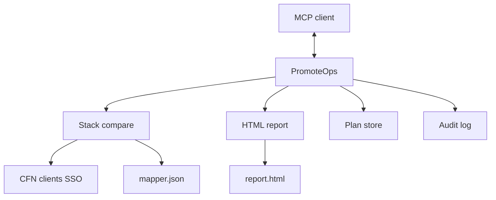

# PromoteOps — Implementation Plan

Living doc. Prefer updating this over treating older drafts as locked.

## 1. Goal

MCP server (`promoteops`) that:

1. Reports CloudFormation stack drift across **dev → test → prod** (HTML + short chat summary).
2. Promotes stacks via **plan → execute** (no writes during plan; elicitation before execute).
3. Never combines plan/diff and apply in one tool call.

**Inspired by** internal StackMate (mapper, statuses, unmapped visibility, env diffs). **Not** a React/.NET app. **OSS v1 is stacks-only** — no S3 config/binary tools.

**Location:** `/Users/hitesh/projects/promoteops`

## 2. Product decisions

| Topic | Decision |
|---|---|
| Stack | TypeScript, MCP SDK, AWS SDK v3 (CloudFormation only) |
| Mapper | `{ mappings: { [template]: [{ dev, test, prod }, ...] } }` with `NOT_DEPLOYED` / `EXCLUDED` |
| Instance id | Deployable stack name (dev, else test, else prod) |
| Compare | Test vs Dev, Prod vs Test |
| Promote from | Local templates path in `config.yaml` |
| Auth | SSO profiles in `config.yaml`; expired → `aws sso login --profile …` |
| Plans / audit | `~/.promoteops/plans/`, `~/.promoteops/` JSONL |
| Ship to work | `npm pack` → Slack → `npm install -g ./….tgz` (bump version to refresh) |

### Status (per env on a mapped instance)

| Status | Meaning |
|---|---|
| `excluded` | Mapper `EXCLUDED` |
| `not_deployed` | Mapper `NOT_DEPLOYED`, or mapped name missing in AWS |
| `current` | Deployed; **hash matches** lower env |
| `outdated` | Deployed; **hash differs** from lower env |

- Dev is never `outdated` (baseline for Test).
- **Ignored / unmapped:** in AWS but not in mapper — visibility only, not promote targets. Shown as a separate end table (“Ignored stacks”).
- Do not use labels `missing`, `in_sync`, or `skipped`.

### Drift (timestamp first, then content)

| Signal | Job |
|---|---|
| Stack timestamps | Decide whether the target is **behind** the source |
| Normalized template fingerprint | Confirm real content drift (ignore formatting noise) |

- **Outdated** only when the **source env is strictly newer** than the target **and** content differs.
- If the target is newer (or times are equal), status stays **Current** for promotion — even if raw `GetTemplate` text differs. That matches “timestamp is source of truth.”
- Content compare: JSON → parse + sorted keys; then whitespace-stripped fingerprint so YAML/JSON formatting does not false-flag. Diffs store normalized bodies for readable HTML.
- Needs action = `outdated` + `not_deployed` (not `excluded`).
- Expired SSO fails the whole report before HTML is written (not a mid-report status).
- Rare “target newer but text differs” is **not** Outdated under this model (no promote-from-lower warning path).

### Code organization

- Feature folders: `config/`, `mapper/`, `stacks/`, `report/`, `aws/`, `tools/`, `shared/`
- Module + test co-located; `shared/` flat
- Types live with the owner module; local consumer shapes across boundaries
- File-level comments only (inline only for non-obvious *why*)
- Plain names; report HTML/CSS under `report/html` + `report/css`
- One public error type per pipeline (`ConfigLoadError`, `MapperLoadError`, `AwsClientError`, …)

## 3. Architecture



```
src/
  shared/  config/  mapper/  aws/clients/
  stacks/stackComparison/   # shapes, shortlist helpers
  stacks/compareStacks/     # M5 live fetch + hash + unmapped
  report/buildReport|html|css/
  fake/                     # Offline fixture report (kept for UX; source=fixture)
  planStore/  audit/        # M6
  tools/reportStacks|diffStack|planStackPromotion|executeStackPromotion/
  server.ts  index.ts
```

## 4. Tools

| Tool | Type | Behavior |
|---|---|---|
| `report_stacks` | read-only | Live compare (default) or `source=fixture` → HTML + chat summary |
| `diff_stack` | read-only | Diff by `templateName` (+ optional `stackName`) for one env pair |
| `plan_stack_promotion` | read-only | Local template + params → `PlanRecord` |
| `execute_stack_promotion` | mutating | Elicit → staleness → change set → execute → audit |

## 5. Milestones

Gate each milestone before starting the next.

| ID | Status | Ship | Test |
|---|---|---|---|
| **M1** | done | Scaffold | `tsc` + process starts |
| **M2** | done | Config + mapper load | Fixtures valid/invalid |
| **M3** | done | CFN clients + SSO errors | Per-env clients; re-login message |
| **M4** | done | Fixture report + MCP tools; matrix-first UX (see §6) | `npm run report:fixture`; no AWS |
| **M5** | done | Live fetch/normalize/fingerprint; timestamp-first outdated; unmapped; fixture retained | Unit tests; `report:fixture`; zero CFN writes |
| **M6** | pending | Plan store + audit | Round-trip without AWS |
| **M7** | pending | Plan + execute promotion; extra caution if target newer | Plan read-only; elicit; stale rejected |
| **M8** | pending | Docs + E2E | Report → plan → execute one stack in Copilot/Cursor |

## 6. Report UX (locked — matrix-first)

Desktop ops report. The **matrix is the report**. No summary cards, no duplicate shortlist section in HTML. Chat gets the capped shortlist; HTML surfaces attention via **sort + filters**.

**Layout**
1. Header: **PromoteOps**, generated time (TZ-explicit), region, **Dev → Test → Prod**
2. Mapped matrix (primary) — row-level “Needs action” when any env is outdated/not deployed
3. Ignored stacks table (end)

**Matrix**
- Columns: Template/Instance · Dev · Test · Prod
- One row per mapper instance; attention-first sort: `not_deployed` → `outdated` → rest
- Cell: status **dot + label**, stack name or special value, compact time, **View diff** when outdated; short hash in `title`
- Sticky header + identity column; beige light theme; system fonts; no CDN

**Filters:** search, status, Needs action only, Clear, “Showing X of Y”. Usable empty state. Without JS, all rows still readable.

**Diff drawer:** slide-over; title Dev→Test / Test→Prod; always embed full normalized diff; Esc/scrim/close; works with `:target` without JS; print shows diffs inline.

**Ignored stacks:** one table (Environment, Stack, CFN status, Last activity); env filter; “not tracked for promotion.”

**Chat (`report_stacks`):** time + source; one pulse line (`N mapped · N ignored`); single `file://` report link. No need-action total in chat/header — row labels in the HTML are the source of truth.

**Packaging:** self-contained `report.html` (inline CSS); write only to configured output path (`0600`, atomic); escape all mapper/AWS text; default path gitignored.

## 7. Out of scope (OSS v1)

S3 config/binary flows · mapper auto-discovery · nested-stack deep compare · React/.NET UI · shared S3 audit · plan+apply in one tool · public npm before the stack path is solid

## 8. Work-machine check

1. M5 against real SSO profiles (or pack after local M5).
2. Bump version → `npm pack` → Slack.
3. Work: `npm install -g ./promoteops-x.y.z.tgz`, `config.yaml` + `mapper.json`, Leapp, MCP → `promoteops`.
4. Reinstall later builds the same way with a new tarball.
